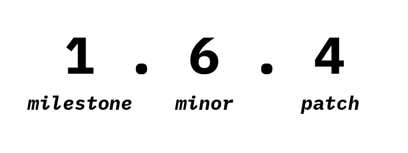

# Non-Breaking Versioning (NonBreakVer)

## Format **`X.Y.Z`**

1. **`MILESTONE (X.0.0)`:** Incremented for **major milestones**, system-wide architectural rewrites, scope expansions, or significant evolution of the project.
2. **`MINOR (0.Y.0)`:** Incremented for **new backward-compatible features**, new functionality, content, or non-disruptive enhancements.
3. **`PATCH (0.0.Z)`:** Incremented for **fixes, corrections**, documentation updates, or routine maintenance. May be omitted when equal to zero (e.g., **`1.2`** instead of **`1.2.0`**).

## NonBreakVer

An intuitive versioning specification for software, design systems, and content-first products that explicitly commit to non-breaking, backward-compatible updates, aligning version numbers with actual project milestones.

## Introduction

Rather than inventing a new convention for its own sake, this is simply the formalization of an existing practice that — to the best of my knowledge — doesn't seem to have a standardized reference or a formal specification.

Most people perceive a new major version of anything — a product, an app, or a game — as something that should bring big changes, new content, or a significant evolution, but that's not how the **[Semantic Versioning](https://semver.org/)** standard works — because that's not what it was trying to communicate or solve.

### SemVer

For **Semantic Versioning**, it's only a **new major version** when there are breaking changes. A complete code base rewrite, a design overhaul, or a massive set of improvements will still be classified as a **minor update** if no compatibility is broken.

This distinction doesn't communicate well when a project reaches a new milestone, be it for marketing reasons or for our own understanding of something that deserves more attention. Consequently, many maintainers choose to define their own versioning systems.

Ultimately, most alternative versioning schemes that attempt to solve this end up forcing backward-compatible projects to carry an artificial **`MAJOR`** digit solely to comply with a breaking-change requirement they will never trigger.

## Bridging the Gap

**NonBreakVer** exchanges **`MAJOR`** in favor of **`MILESTONE`**, while retaining standard **SemVer** mechanics for the lower digits **`MINOR`** and **`PATCH`**.

## Guiding Principles

- **Backward Compatibility:** Updating a **NonBreakVer** project must never intentionally break user configurations, supported environments, or any previously supported functionality — regardless of which segment of the version number changes.
- **Additive Mechanics:** Features and properties are added, refined, or sanitized. Deprecations must be handled gracefully without dropping support abruptly.
- **Intuitive Versioning:** The **`MILESTONE`** number communicates a version progression that people intuitively understand, while **`MINOR`** and **`PATCH`** maintain precision for tooling and tracking at a glance.

## Non-Breaking Versioning Specification

**1.** Version numbers take the form **`MILESTONE.MINOR(.PATCH)[-PRE][+BUILD]`**, where **`MILESTONE`**, **`MINOR`** and **`PATCH`** are non-negative integers with no leading zeroes — and when **`PATCH`** is **`0`**, it may optionally be omitted from the written version. **`PRE`** and **`BUILD`** are optional identifiers made up of ASCII alphanumerics, hyphens, and dots.

**2.** This scheme is meant for projects that commit to never introducing breaking changes — either because the project has no public API to break, or because the maintainer treats backward compatibility as a strict, self-imposed rule even when breaking changes would technically be possible.

**3.** Once a release is out, its contents shouldn't change. If something needs fixing, ship it as a new release instead.

**4.** **`MILESTONE`** version zero (**`0.x.x`**) is for initial development, before the project is considered stable.

**5.** Each release's version number builds on the one before it, following the next two rules.

**6.** Bump **`MILESTONE`** when the release feels significant enough to mark a new era for the project — a big enough combination of new content, structural change, or overall impact that it deserves to stand apart from what came before. This is a judgment call by whoever maintains the project, not a fixed rule. When **`MILESTONE`** bumps, **`MINOR`** and **`PATCH`** reset to **`0`**.

**7.** Otherwise, bump **`MINOR`** when the release adds anything new — content, functionality, capability. When **`MINOR`** bumps, **`PATCH`** resets to **`0`**.

**8.** Otherwise, bump **`PATCH`** — this covers releases that only fix or correct something, without adding anything new.

**9.** A pre-release version can be marked by appending a hyphen and a dot-separated identifier right after **`PATCH`**, made only of alphanumerics, dots, and hyphens. Pre-release identifiers can't be empty, and are only meant for unstable previews of a future release.

> Examples: `1.0.0-alpha`, `1.0.0-alpha.1`, `1.0.0-beta`, `1.0.0-0.3.7`, `1.0.0-rc.1`

**10.** Build metadata can be added by appending a plus sign and a dot-separated identifier right after the pre-release identifier (or **`PATCH`**, if there's no pre-release tag). Same character rules apply, and it's only for identifying a specific build of a release, not the release itself.

> Examples: `1.0.0-alpha+001`, `1.0.0+20260313144700`, `1.0.0-beta+exp.sha.5114f85`.

**11.** To compare versions, check **`MILESTONE`** first — if they differ, that decides it. If not, check **`MINOR`**, then **`PATCH`**. When comparing precedence, an omitted **`PATCH`** is treated as **`0`**. If all three match, a pre-release version always ranks lower than the equivalent normal release.

> Example: `1.0.0 < 2.0.0 < 2.1.0 < 2.1.1 < 2.1.2-rc.1 < 2.1.2-rc.2 < 2.1.2`.

## Non-Breaking Changes Project Types

- **Editorial/documentation content** — guides, FAQs, published books/chapters, not specs.
- **Visual themes** — color themes, icon themes, UI themes.
- **Wallpapers, icon packs, cursor packs** — same logic as themes.
- **Typefaces / fonts** — adding weights, glyphs, or adjusting kerning never breaks existing installs.
- **Non-programmatic configuration presets** — camera presets, audio EQ presets, color LUTs.
- **Cosmetic game assets** — skins, maps, textures.
- **Résumés, slide decks, presentations** — no technical dependency involved.
- **Read-only published datasets** — the raw data itself, not a query API.
- **Informal specs/conventions** — no programmatic consumer to break by reading a new version.

## License

[CC BY 4.0 (Creative Commons — Attribution 4.0 International)](https://creativecommons.org/licenses/by/4.0/)

- Anyone is free to **share** (copy and redistribute in any medium or format) and **adapt** (remix, transform, build upon) the material, for any purpose, including commercial,
- **Attribution**: you must give appropriate credit to the original author, provide a link to the license, and indicate if changes were made.
- No additional restrictions may be applied that would prevent others from doing what the license permits. It's one of the most permissive **Creative Commons** licenses — the only requirement is attribution.

